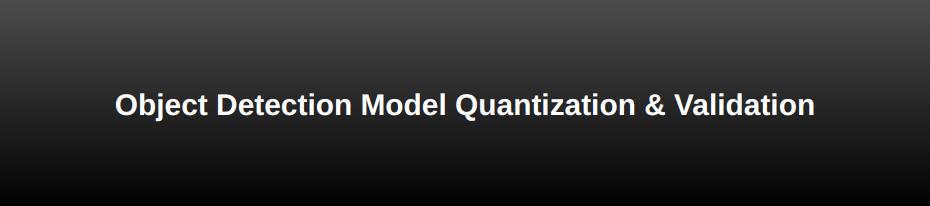
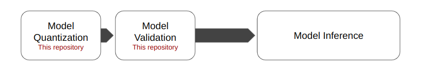

<div align="center">
    
</div>

This repository is the first part of **Optimization of Object Detection on LattePanda 3 Delta**. The second part can be found [here](https://github.com/arshemii/detection_on_cpu).
<div align="center">
    
</div>


This repository presents a workflow for quantization of object detection models using OpenVino NNCF for CPU-based edge devices. The quantization is done on 6 different Object Detection models (**YOLOv5nu, YOLOv8n, YOLO11n, CenterNet, DETR, and EfficientDet, all trained on Coco2017**), and tested and inferenced in [this repository](https://github.com/arshemii/detection_on_cpu). You can inspect more about quantization in:

- [&nbsp;OpenVino Documentation](https://docs.openvino.ai/2024/index.html)


----------------------------------------------------------------
## A brief workflow description:
&nbsp;&nbsp; 1. A dataset for evaluation and calibration is prepared
&nbsp;&nbsp; 2. A data loader to get data from dataset is prepared
&nbsp;&nbsp; 3. A transorm_fn in defined to preprocess the data for the IR model
&nbsp;&nbsp; 4. Using the data loader and transform_fn, an instance of nncf dataset is created
&nbsp;&nbsp; 5. The model is optimized using the nncf dataset

----------------------------------------------------------------
## Before running anything:
&nbsp;&nbsp; 1. Validation dataset of Coco2017 shall be downloaded from http://images.cocodataset.org/zips/val2017.zip <br>
&nbsp;&nbsp; 2. It should be placed into ./datasets/ --> final structure should be: <br>
```plaintext
datasets/
└── coco/
    ├── annotations/
    │   └── instances_val2017.json
    ├── images/
    └── labels/
        └── val2017/
            ├── 000000000009.jpg
            ├── 000000000025.jpg
            ├── 000000000044.jpg
            └── ...
```
&nbsp;&nbsp; 3. You should have [IR original models](https://drive.google.com/drive/folders/1W2Qj5whzkqUeCw6xSJimytYBpeU7ErsA?usp=sharing) in ./models/ <br>
&nbsp;&nbsp;&nbsp;&nbsp;&nbsp;&nbsp; --> final structure should be:<br>
```plaintext
models/
├── {model_name}_openvino_model/
│   ├── IRmodel.bin
│   ├── IRmodel.xml
├── ...
```
&nbsp;&nbsp; 4. For EfficientDet, you need a .tfrecord file to put in ./EFFDET/tfrecord/.<br>
&nbsp;&nbsp;&nbsp;&nbsp;&nbsp;&nbsp; Downlod it from [here](https://drive.google.com/drive/folders/1W2Qj5whzkqUeCw6xSJimytYBpeU7ErsA?usp=sharing)

-------------------------------------------------------
## How to use:
&nbsp;&nbsp; 1. Run inside the terminal <br>
```markdown
python3 main.py --arch effdet --mode eval_qnt

# --arch choices: ['yolov5nu', 'yolov8n', 'yolo11n', 'ctdet', 'detr', 'effdet']
# -- mode choices: ['qnt', 'eval_orig', 'eval_qnt']

```

## References:
- https://docs.openvino.ai/2024/index.html
- https://docs.ultralytics.com
- https://github.com/google/automl/tree/master/efficientdet
- https://github.com/xingyizhou/CenterNet
- https://github.com/facebookresearch/detr

## Contact:
- [&nbsp;Email](arshemii1373@gmail.com)
